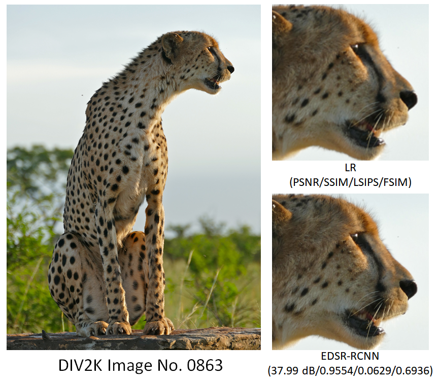

# Super-Resolution Image Reconstruction based on Random-coupled Neural Network and EDSR

## Introduction

This project presents an implementation of the EDSR-RCNN model, a deep learning approach that demonstrates strong super-resolution reconstruction performance. The model utilizes the Random-coupled Neural Network (RCNN) [1] to effectively extract mid to high-scale feature information from images without the necessity of complex training procedures or expensive deep neural architectures. By incorporating these spatiotemporal features, the EDSR-RCNN model enhances the convolutional kernel scale of the Enhanced Deep Residual Network(EDSR) [2], enabling the acquisition of richer image features.

If you find our work useful in your research or publication, please cite our work:

Haoran Liu, Kaimin Wang, Mingzhe Liu, Xue Zuo, Peng Li, and Ruili Wang "Super-Resolution Image Reconstruction based on Random-coupled Neural Network and EDSR." Not published yet. 




This project is based on the EDSR project“ https://github.com/sanghyun-son/EDSR-PyTorch ”The specific structure and functional implementation of the EDSR model developed can be found in the article:

[1] Bee Lim,  Sanghyun Son, Heewon Kim, Seungjun Nah, and Kyoung Mu Lee,  "Enhanced Deep Residual Networks for Single Image Super-Resolution," 2nd NTIRE: New Trends in Image Restoration and Enhancement workshop and challenge on image super-resolution in conjunction with CVPR 2017. 

## Dependencies
* Python 3.6

* PyTorch >= 1.0.0

* numpy

* skimage

* imageio

* matplotlib

* tqdm

* PIL

* cv2 >= 3.xx (Only if you want to use video input/output)

## Code:
   You can directly run the **`demo.sh`** in the src folder or use terminal commands to conduct experiments.
   
   For example:

   ```bash
   cd src       
   sh demo.sh
   ```

## How to train and test EDSR-RCNN： 

   Because we use the DIV2K dataset to train and test our model, please download the dataset from the links provided in the dataset and model results section at the end.
   There are several points to pay attention to during the training and testing process.
   
   * you need to set the **`--dir_data`** in **`option.py`** to the path where the DIV2K dataset is located. If there are specific requirements for storing the dataset, you need to modify the **`--dir_data`** to the specified path.


   * If you want to train the model on other datasets, you need to adjust **`--data_train`** and **`--data_test`** to the name of that dataset.


   * If you want to continue training process on the pre-trained model, you need to set **`--pre_train`** as the path of the model.


   * The RCNN channel of the model is enabled by default. If you want to train the original EDSR model, set **`--RCNN_channe`** to **`off`**.


   * If you only want to test on a trained model, you need to add **`--test_only`**.


   * If you want to adjust the relevant parameters of the EDSR model, you only need to specify them before running **`demo.sh`**.


   * We have adjusted a set of RCNN model parameters applicable to the DIV2K dataset, so the parameters of the RCNN model need not be adjusted. If you want to train the EDSR-RCNN model on other datasets, please adjust the RCNN model parameters in advance.
## Usage
1. You should first construct the dataset folder according to a specific structure.
   ```
   dataset/
   └── DIV2K/
       ├── DIV2K_train_HR/
       │   ├── 0001.png
       │   ├── 0002.png
       │   └── 0003.png
       ├── DIV2K_train_LR_bicubic/
       │   └── X2/
       │       ├── 0001x2.png
       │       ├── 0002x2.png
       │       └── 0003x2.png
   ```

2. You can enter specified commands in the **`demo.sh`** file according to your own needs to build the training and testing process.
   For example, if you want to train a model on a certain dataset, the training set is the first seven hundred images, the testing set is the last hundred images, the number of residual blocks in the model is 32, and the residual linking factor is 0. 1. The number of feature maps is 100, and the loss type is selected as smoothl1loss. You can run the following line of code.
   ```bash
   python main.py --model EDSR --scale 2 --data_range 1-700/701-800 --save your_path --n_colors 1 --n_resblocks 32 --res_scale 0.1  --loss 1*SmoothL1Loss --reset --n_feats 100
   ```
   
3. If you only want to test on the trained model, you need to add **`-- test_only`** and specify where the image to be tested is in the dataset. For example, to test the last two images of the DIV2K dataset on the trained model, you can run the following code:
   ```bash
   python main.py --model EDSR --scale 2 --data_range 1-700/799-800 --save your_path --n_colors 1 --n_resblocks 32 --res_scale 0.1  --loss 1*SmoothL1Loss --reset --n_feats 100 --test_only --pre_train 'your_model_path'
   ``` 
5. You can find the result images from **`experiment/test/results/your_path`**.
## Optuna parameter tuning
Optuna is an open-source automated hyperparameter optimization framework designed to help developers and researchers efficiently tune the hyperparameters of machine learning models[2]. It offers a simple yet powerful way to find the best combinations of hyperparameters, thereby enhancing model performance.

You can directly run the **`optuna_utility.py`** file to adjust parameters. If there are other parameters that need to be adjusted, they can be specified in the **`objective`** function, taking the learning rate as an example.
   ```bash
   lr_star = trial.suggest_float("lr_star", 1e-6, 1e-4, log=True)
   ```

[2] Akiba, Takuya, et al. "Optuna: A next-generation hyperparameter optimization framework." Proceedings of the 25th ACM SIGKDD international conference on knowledge discovery & data mining. 2019.

## Dataset and model results

This application will open source all trained models and test results, as well as the DIV2K dataset, which you can download here [](10.5281/zenodo.13340845).
