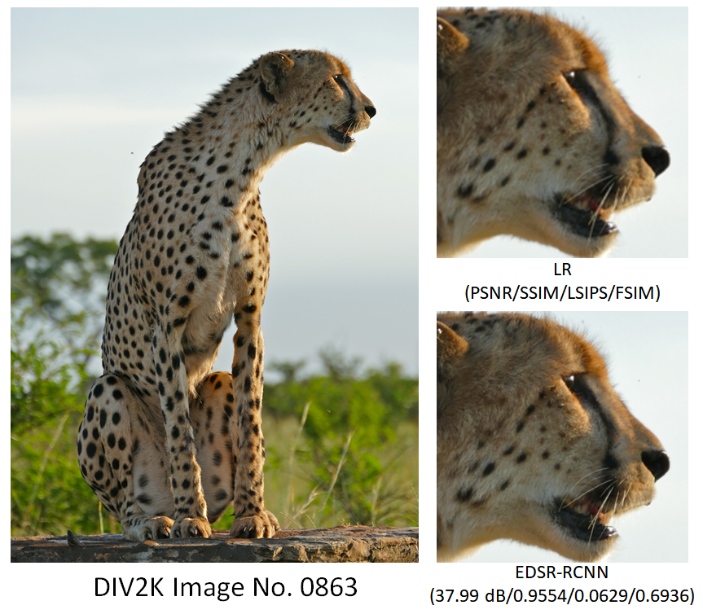

<div align="center">

### EDSR‑RCNN: Super‑Resolution Image Reconstruction based on Random‑coupled Neural Network and EDSR



</div>

### Introduction

This repository implements EDSR‑RCNN, which enhances EDSR with an additional Random‑coupled Neural Network (RCNN) channel to inject mid‑/high‑level structural priors into the backbone. RCNN features are fused with the image stream via learnable heads for improved single‑image super‑resolution (SISR).

- **Backbone**: EDSR [2], plus MDSR and VDSR variants
- **RCNN channel**: on‑the‑fly ignition maps computed from LR images
- **Fusion heads**: selectable fusion between image and RCNN channels
- **Training**: PyTorch with multi‑GPU, background result writers, PSNR logging
- **Tuning**: Optuna integration for automated hyperparameter search

If you use this code, please cite:

Zuo, X., Liu, H., Liu, M. et al. Super‑Resolution Image Reconstruction based on Random‑coupled Neural Network and EDSR. SIViP 19, 803 (2025). `https://doi.org/10.1007/s11760-025-04185-6`

Related works: [1], [2].

### Requirements

- Python 3.8+
- PyTorch (CUDA recommended) or MPS (Apple Silicon) on macOS, torchvision
- numpy, scikit‑image, imageio, Pillow
- matplotlib, tqdm
- opencv‑python (for RCNN/data prep)
- thop, fvcore, ptflops (optional FLOPs/params utils)
- optuna, optuna‑dashboard (optional HPO)

Install with pip (example):

```bash
pip install torch torchvision --index-url https://download.pytorch.org/whl/cu121  # pick the wheel for your CUDA
pip install numpy scikit-image imageio pillow matplotlib tqdm opencv-python thop fvcore ptflops optuna optuna-dashboard
```

### Supported models

- `EDSR` (baseline)
- `EDSR_RCNN` (this work)
- `MDSR`
- `VDSR`

### Data preparation

Set `--dir_data` to the parent directory that contains datasets. For DIV2K it should look like:

```
<dir_data>/
└── DIV2K/
    ├── DIV2K_train_HR/
    │   ├── 0001.png
    │   └── ...
    └── DIV2K_train_LR_bicubic/
        └── X2/  (or X3/X4 depending on --scale)
            ├── 0001x2.png
            └── ...
```

When `--RCNN_channel on`, RCNN ignition maps and merged LR files are generated on first run under the same dataset root:

- No resize: `DIV2K_RCNN_train_LR_bicubic/`
- With `--resize on`: `DIV2K_RCNN_resize_train_LR_bicubic/` and `DIV2K_RCNN_resize_train_HR/`

These are created automatically; you do not need to prepare them manually.

### Quick start

From the `src/` directory.

Train EDSR (baseline):

```bash
python main.py --model EDSR --scale 2 --dir_data /path/to/datasets \
  --data_train DIV2K --data_test DIV2K --data_range 1-790/791-800 \
  --n_colors 3 --n_resblocks 32 --n_feats 256 --res_scale 0.1 \
  --batch_size 8 --epochs 1000 --save edsr_x2 --cuda cuda:0
```

Train EDSR‑RCNN (with RCNN channel):

```bash
python main.py --model EDSR_RCNN --scale 2 --dir_data /path/to/datasets \
  --data_train DIV2K --data_test DIV2K --data_range 1-790/791-800 \
  --n_colors 3 --n_resblocks 32 --n_feats 290 --res_scale 0.3 \
  --RCNN_channel on --model_head SKFusion \
  --batch_size 8 --epochs 1000 --save edsr_rcnn_x2 --cuda cuda:0
```

Notes:

- When `--RCNN_channel on`, set `--model_head` to one of: `adaptive`, `SKFusion` (case-sensitive). Do not use `Convolution` in this case.
- For grayscale training, set `--n_colors 1`.

Test a trained model:

```bash
python main.py --model EDSR --scale 2 --dir_data /path/to/datasets \
  --data_test DIV2K --data_range 799-800 \
  --n_colors 3 --n_resblocks 32 --n_feats 256 --res_scale 0.1 \
  --test_only --pre_train /path/to/model_best.pt --save edsr_x2_test --cuda cuda:0
```

Benchmark datasets are also supported via `--data_test Set5+Set14+B100+Urban100`.

You can also use the provided script (Linux/macOS):

```bash
cd src
sh demo.sh
```

### Where results and logs go

- Experiments: `experiment/<save>/`
- Checkpoints: `experiment/<save>/model/`
- PSNR curves: `experiment/<save>/test_<DATASET>.pdf`
- SR/LR/HR images: `experiment/<save>/results-<DATASET>/filename_x<SCALE>_SR.png`

### Key options (most useful)

- `--dir_data`: dataset root (parent of `DIV2K/`, `benchmark/`, ...)
- `--data_train`, `--data_test`: dataset names (e.g., `DIV2K`, `Set5`)
- `--data_range`: train/test split, e.g., `1-790/791-800`
- `--scale`: upscaling factor(s), e.g., `2` or `2+3+4`
- `--n_colors`: 1 for grayscale, 3 for RGB
- `--RCNN_channel`: `on`/`off` to enable the extra RCNN channel
- `--model_head`: when RCNN is on, choose `adaptive` or `SKFusion`
- `--resize`: `on`/`off` to pre‑resize images before RCNN processing
- `--cuda`: device string, e.g., `cuda:0`. On macOS, if MPS is available it is selected automatically; use `--cpu` to force CPU.
- `--test_only`: run only evaluation using `--pre_train`
- `--save`: experiment name
- `--n_threads`: dataloader workers (set lower on Windows if needed)

Advanced:

- Learning rate and schedule: `--lr`, `--decay`, `--gamma`
- Memory: `--chop` for memory‑efficient forward, `--patch_size`, `--batch_size`
- Precision: `--precision single|half` (half currently applies to both training and testing)
- 8‑bit/16‑bit images: set `--rgb_range` and `--ori_rgb_range` (e.g., `255` for 8‑bit, `65536` for 16‑bit)

### Optuna hyperparameter tuning

The script `src/optuna_utility.py` shows how to tune model capacity and training hyperparameters.

```bash
cd src
python optuna_utility.py
```

Inside the `objective` you can add more search dimensions, for example:

```python
lr_star = trial.suggest_float("lr_star", 1e-6, 1e-4, log=True)
```

### Downloads (models, results, dataset)

All trained models, test results, and the DIV2K dataset are hosted on Zenodo: [DOI 10.5281/zenodo.13340844](https://doi.org/10.5281/zenodo.13340844).

### Troubleshooting

- DataLoader workers on Windows: try `--n_threads 0`–`4` if you encounter spawn issues.
- CUDA OOM: reduce `--batch_size`/`--patch_size`, or enable `--chop`.
- RCNN fusion head: when `--RCNN_channel on`, set `--model_head adaptive` or `--model_head SKFusion`.
- Paths: ensure `--dir_data` points to the parent directory that contains `DIV2K/`.

### Acknowledgements

Codebase derived from `EDSR-PyTorch` by Lim et al. `https://github.com/sanghyun-son/EDSR-PyTorch`

### Citation

If you find this repository helpful, please cite:

```
@article{zuo2025sr_rcnn_edsr,
  title   = {Super-Resolution Image Reconstruction based on Random-coupled Neural Network and EDSR},
  author  = {Zuo, X. and Liu, H. and Liu, M. and others},
  journal = {Signal, Image and Video Processing},
  volume  = {19},
  pages   = {803},
  year    = {2025},
  doi     = {10.1007/s11760-025-04185-6}
}

@article{liu2024rcnn,
  title   = {Random-coupled Neural Network},
  author  = {Liu, H. and Xiang, M. and Liu, M. and Li, P. and Zuo, X. and Jiang, X. and Zuo, Z.},
  journal = {Electronics},
  volume  = {13},
  number  = {21},
  pages   = {4297},
  year    = {2024}
}
```

References:

- [1] Liu H, Xiang M, Liu M, Li P, Zuo X, Jiang X, Zuo Z. Random‑coupled Neural Network. Electronics, 2024.
- [2] Bee Lim, Sanghyun Son, Heewon Kim, Seungjun Nah, Kyoung Mu Lee. Enhanced Deep Residual Networks for Single Image Super‑Resolution, CVPR NTIRE 2017.

### License

MIT License (see `LICENSE`).
